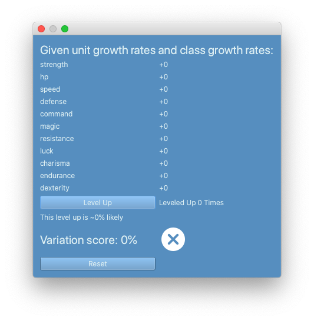
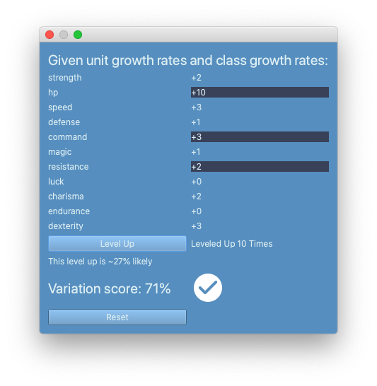

Stat Growth
#############

.. contents::

How does stat growth work?
-----------------------------
Usually, when a unit levels up, they will *always* gain +1 in at least one stat as well as HP. To make sure of this, if a level up results in no stat growth, or just HP, one stat will be picked at random to receive a boost. 

**To ensure that HP always gains, you should set the growth rate for HP to 100%.** Actually, it's there by default, so as long as you leave that slider alone, it will work as expected. (If you want to make HP *not* a given, you can still adjust it!)

Otherwise, stat growth is based on the percentages set for the unit and, possibly, the class. To determine whether classes can influence stat growth, see this option in the game editor: 

   
Unit stat growth vs. unit + class stat growth: which to choose?
-----------------------------------------------------------------
With unit stat growth, no matter the class, level ups will always have the same chances of growth. This is a fairly common choice in games of this genre; if someone has a natural talent for magic, for example, and they're set as a brawling class, they're not going to start gaining stats helpful to brawling just because of the class. 

With both, units can "lean into" their class and gain stats useful for it. This could come with some cons: if a magic unit is assigned a brawling class and starts learning Strength, they're missing out on their *real* strength: magic. 

Both options make for a very interesting game style! The choice is yours. 

How does unit + class stat growth work? 
----------------------------------------
For each stat, the % chance of levelling up is the average of the unit stat growth chance and the class stat growth chance. For example, if the unit stat growth rate for Dexterity is 80%, and the class growth rate is 30%, the growth rate is 55%. 

How can I make sure my level up rates are fair, balanced, and interesting?
---------------------------------------------------------------------------
Making sure that each level up feels unique is a huge part of making an interesting game. If a unit always gains Magic and Resistance and never gains Strength, for example, they're quickly going to become both overpowered and boring. The unknown of what's going to happen on a level up is the primary interest factor for level ups. Thus, you need to have both good, bad, and neutral level ups for each unit. 

There's a great way to test this in the **Unit Editor**. Click **Stat Growth Rates**, then click **Test**. You should see this: 

First, you can see that this editor uses both unit and class growth rates. If you're not using class growth rates, your class growth rates will be removed from the equation. To be more specific: if you haven't set class growth rates, they won't factor in here. 

Under that heading we have the stat growth. Whenever you click **Level Up**, these stats will grow. The stats that grew on that level up will be highlighted, and the right column will be updated with the totals so far. Under "Level Up" is an indicator of how likely this level up would be to repeat. Underneath that is a **variation score** and an associated icon. You should level up 10 or more times to get an accurate variation score. If, after levelling up 10 times, you have a checkmark icon, you have a well-balanced set of growth rates that will produce different results each time. If you have a warning icon, (!), your level ups will be somewhat predictable. You should shake up your growth rates. Lastly, if you have an X icon, your level ups are entirely unbalanced, predictable, and boring. You need to make significant changes. 

Here's what you might see after running those tests:

   
You'll notice that HP is +10, meaning each level up gave HP. The variation score is 71%, which means the level ups are unpredictable. Things are looking good, in other words.

To help your variation score, no stat should have a 100% growth chance except HP. Also, no stat should have a 0% growth chance. 

You can click **Reset** to clear everything out. 
