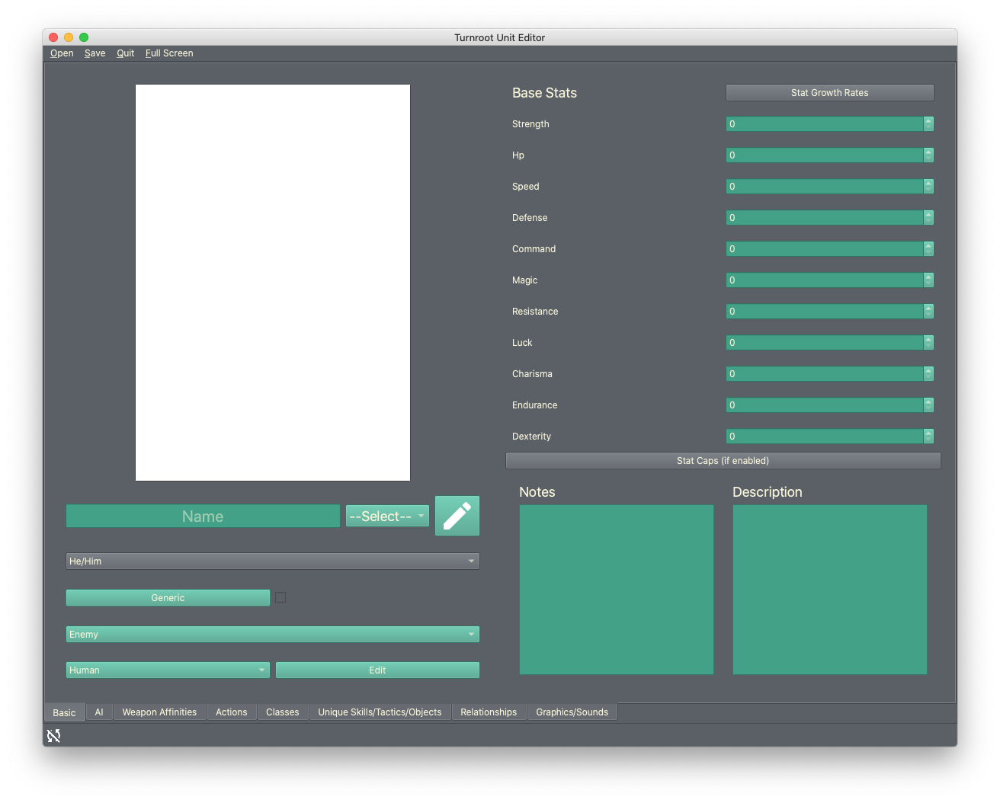
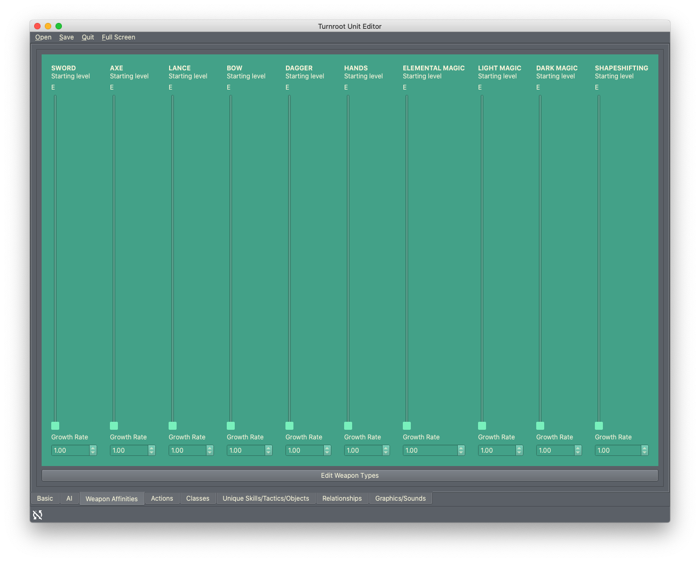
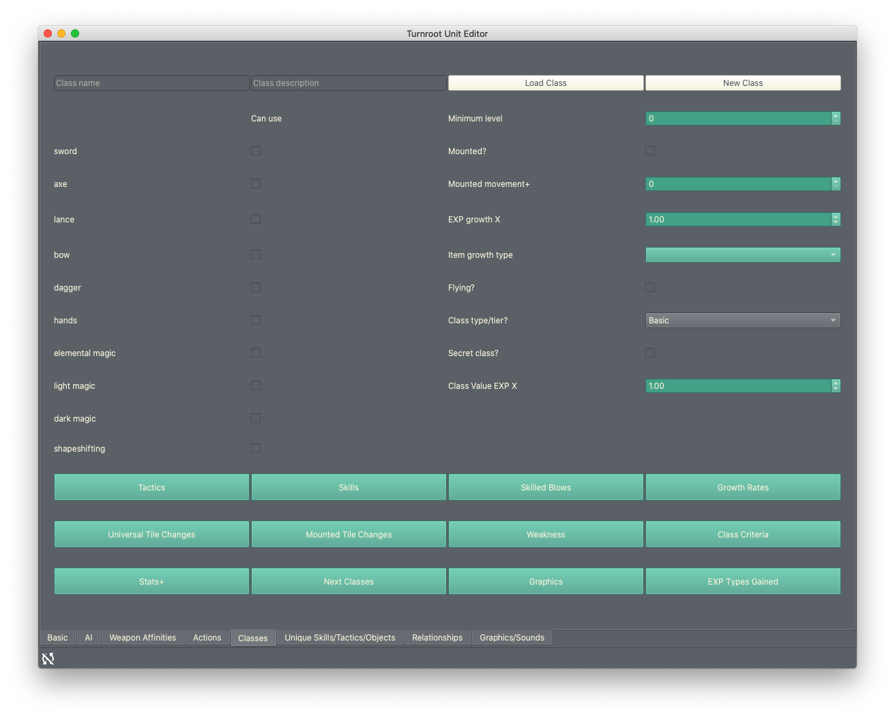
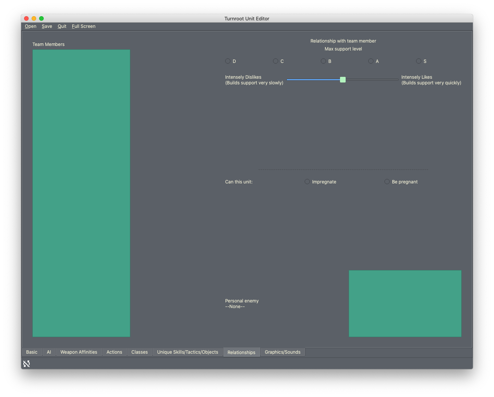
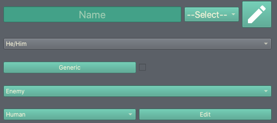
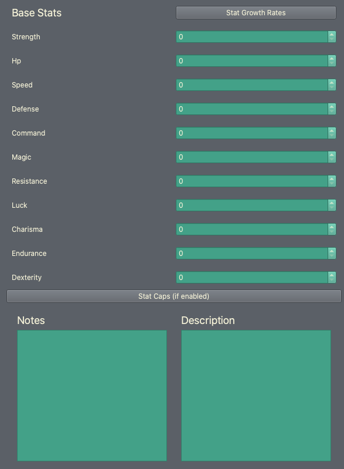

Using the Unit/Class Editor, Part 1
=====================================
Now that you've set some basic game options, you can start learning about the other editors. We're starting with the unit/class editor because it's the default editor you'll see whenever you open Turnroot in the future.

The unit/class editor is unique, in that it is used to create and edit two separate types of things.  However, units and classes are so closely connected that it made more sense to combine them this way.

Some quick definitions: a **unit** is a character; a protagonist, an enemy, a team member, etc. A **class** defines how a unit behaves in combat, what weapons they can use, etc. These terms are used the same way they might be in a *Fire Emblem* game. 

.. contents::

.. unit-class-overview:
Editor overview- what am I looking at?
----------------------------------------

Basics
###########

This is the front page of the editor, where the most basic attributes of a unit are set. 

AI
########

.. image:: 003_uai.png
   :alt: Screenshot of Turnroot unit/class editor, AI tab
   :align: center

This tab sets how the unit will behave when controlled by a computer. Currently, this means enemy units and ally units- there's no autoplay for team units. 

Weapon Affinities
##################

Here you can set two things: what weapon experience levels this unit starts with, and how quickly/efficiently this unit will gain weapon experience. This second use is why the tab is called "affinities"- if the unit grows more quickly in a certain weapon, they have an affinity for it. 

Actions
#########

Classes
#######

Rather than editing units, this tab is for editing classes. You can have two separate files open this way: a unit, and a class, and edit both. Switching between tabs will change what saving does. Saving in this tab will save the class. Saving in other tabs will save the unit. 

If this seems confusing, don't worry- both units and classes autosave, so you shouldn't have to worry about it. 

Unique
#######

Relationships
##############

This tab allows you to set how this unit will interact with other units. This is primarily for team units: the ability to build support and have children is irrelevant to enemies.

There are some exceptions to this guideline. Allies may benefit from these options if they are recruitable, and any unit can have a "personal enemy". 

Graphics/Sounds
###############

Creating a unit
------------------------
Let's go ahead and make a simple unit just to see how all this works. We're going to make a team member to skip the AI tab. Normally at this point, you would do some planning/brainstorming. We're going to do that for you so you can learn the interface; after that, you can start making the units of your dreams. 

Basics and bare minimums
#########################

The most important thing a unit can have is a **name**. That's not just a gesture of kindness towards your new, fictional, friend: once you give your unit a name and press Enter, you'll be able to choose the filename. Once you set the filename, all the changes you make will auto-save. Thus, you should always start a unit by giving them a name. 

You can change the name at any point, and the filename doesn't need to be related to the unit name at all. You just need a unit name to *trigger* the filename selection, and by extension, saving your unit. 

So, without further ado, go ahead and give your unit a name by typing in a name you want here:

Once you press enter, you'll be prompted to enter a filename- go ahead and do that, something like "Test Unit", and click Ok. You are now auto-saving.

Congratulations, you've just created a unit! If you open your game folder, you'll find two new files in your ``game_folder/units`` subfolder: ``Test Unit.truf``, and ``Test Unit.truf.trui``. These are the files associated with your unit that will auto-save. You need both, don't delete one!

There are two other fields in that screenshotted section; a **drop-down menu** and an **Edit button**. The Edit button allows you to set what classes this unit could have and the drop-down menu allows you to set the class the unit does have. This is less complicated than it sounds. Every unit can have at least one base class, and they can switch between them when reclassing. The drop-down menu lets you say which of these possible classes is the default, or the one they'll have in the game until changed. 

Currently, you don't have any classes, which means you can't do anything with either of those options. We'll get there!

There are a couple of other things you can do here. In case you're lost, here's a screenshot showing everything we'll be talking about:
 

First, you need to set this unit's **pronouns**. This will affect how they are referred to in dialogue. You can do this in the drop-down menu directly below the name row. 

Below this, you can set whether this unit is **generic** or not. A generic unit is a template for many clones or instances. These instances can have variations in appearance and stats. For example, an "enemy archer" could be just one unit- named "Enemy Archer", and you could give them variations to make the appearance of different units. To make a unit generic, click the **checkbox** next to "Generic". You can then set the variation options with the "Generic" button. 

Team members are not generic, so you can move past this for now. 

The next row lets you set the **classification** of this unit. This is mainly useful for weapon effectiveness; for example, if the unit is a dragon, they'll be weak against dragon-effective weapons. Click "Edit" to change the universal classifications. You can use this to change the theme of your game; changing fantasy to sci-fi, for example. You can leave your test unit as a Human. 

Base statistics: what do they mean, and how do I use them? 
############################################################

On the right side of the editor, you can edit the **base statistics** and **statistic growth** rate of your unit. Base statistics determine who the unit is, and growth determines who the unit will become. You can hover over any of the statistics to learn what they influence. 

This list may not match yours, by the way; you can disable Command and Endurance entirely in the game options. (Read about why you would do that in :doc:`game_options`)

There's only one stat that must be higher than 0 for the unit to work correctly: HP (health points).  **A unit with no maximum health cannot be in combat/gain support/do anything.** 

**Stat caps** lets you set the maximum amount this unit can have of each stat. If you hadn't guessed from the (if enabled), this can be turned on or off in the game options. 

**Notes** lets you leave yourself notes about this unit- for example, "this unit doesn't have a class assigned yet". That was partially an example and partially a suggestion; your friendly neighborhood Test Unit does not, in fact, have a class assigned, so this would be a good note to leave. Go ahead and do that! It will save automatically.

**Description** is the flavor text that will show in-game for this unit. 

**Stat Growth Rates**, lastly, lets you set how likely the unit is to gain each stat when leveling up. This button also has a super useful test functionality where you can make sure level-ups will be unique and well-balanced. You can learn more about this in :doc:`stat_growth`.

We've skipped over the big white button on this tab for now. That button, and the associated editor, are for working with **portraits**. I bring this up as an example of how everything in the builder is connected; you will probably be switching between editors pretty often as you use it. 

Giving your unit weapon affinities
###################################

Now that you've got the barebones laid down on the Basics tab, we can move to the next tab! We can skip AI because our unit doesn't need it. We'll also be skipping actions for the sake of keeping this tutorial simple. This takes us to the **Weapon Affinities** tab. 
This is what you should be seeing:

This tab is incredibly simple, and it will probably take only a few seconds to use. Each slider represents how much **weapon type experience** the unit has at level 1. You can use this to give them a natural advantage or head start with weapon types. The number under each slider allows you to change how quickly they gain experience in this weapon type. This is an optional feature, you can leave all the numbers at 1 for normal growth. 

There are two things to note here. 

First, you may be expecting a wider range of weapon experience levels. To put it simply, you may find the "E-S" range limited, and be asking "what about E+ and D+ and all the other pluses?" No worries! You can absolutely change that! It's in the game options, so if you want to change it, switch editors and then come back. (Remember you can press Esc to switch editors.) 

Second, you can also edit the **universal weapon types** here. Universal is not an exaggeration- any change made in this dialog will affect the entire game. You can also add/remove/edit weapon types in the game options. 

Most things, you can change at any time. Weapon types are an exception of sorts. If you think about it, if you make a bunch of "shapeshifting" weapons and then delete "shapeshifting" as a weapon type, you now have a pile of weapons without a usable type. The weapons **simply will not appear in the game, anywhere!** Turnroot will, rather than allowing weapons that would give an error if used to be in the game, pull them out entirely. 

Long story short: weapon types are one of the first things you should set when making a game, and you should not change them later. You can, if needed, just remember the dangers. 

Go ahead and look over the weapon types and edit them to your liking, or just leave them as they are. You can learn more about editing them in :doc:`weapon_types`. 

Relationships: Test Unit + other units
##########################################
Again for the sake of keeping this simple, we're jumping to the **Relationships** tab. This is what you'll see there: 

Note: you can't actually do much in this tab (yet!) You need other units.

Support
^^^^^^^^
For each "team member" unit (remember, you can set this on the Basics tab), you have the option to set how high their max support can go, and how hard support is to gain. Each team member will show up in the list on the left. Clicking through them will allow you to set these settings for each unit. 

Let me provide an example, so this makes more sense. Let's say you have two additional units, Test Unit A and Test Unit B. Both of these units are on the same team as Test Unit. Let's say Test Unit doesn't get along with Test Unit A but loves Test Unit B. Here's how you would set this:

* Click on Test Unit A from the list on the left.
* Now that Test Unit A is selected, set max support to be, let's say, C.
* Move the slider towards the left; probably not all the way to "intensely dislikes", but definitely left of center.
* Now it's time for Test Unit B. Click on them from the list.
* Doing this will reset the max support level and slider. You can click back to Test Unit A and see that the values will change to match. 
*  With Test Unit B selected, set max support to S and move the slider to the right. 

Pretty simple!

Personal Enemy
^^^^^^^^^^^^^^^^^
A **personal enemy** is used in AI calculations. All you have to do to set a personal enemy for a unit is click on them from the list.

Children
^^^^^^^^^
You can, in the game options, turn on child units and potentially allow them to be recruitable through paralogue battles. If you're not interested in that, you can turn it off and ignore this. 

The **Can impregnate** and **Can be pregnant** option allow you to set what effect this unit has on their children units. 

You can read more about what that means in :doc:`marriage_and_children`. For now, since you don't have any other units, you can tuck this all away for later. 

In the next document you're going to make your first class. Feel free to take a breather or play around in the unit editor. The best way to learn how to use Turnroot is, ultimately, to use it. When you're ready, go ahead and continue: :doc:`unit_class_editor_p2`
