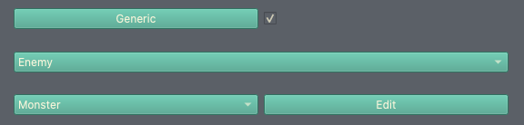
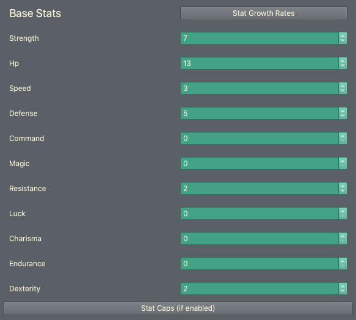
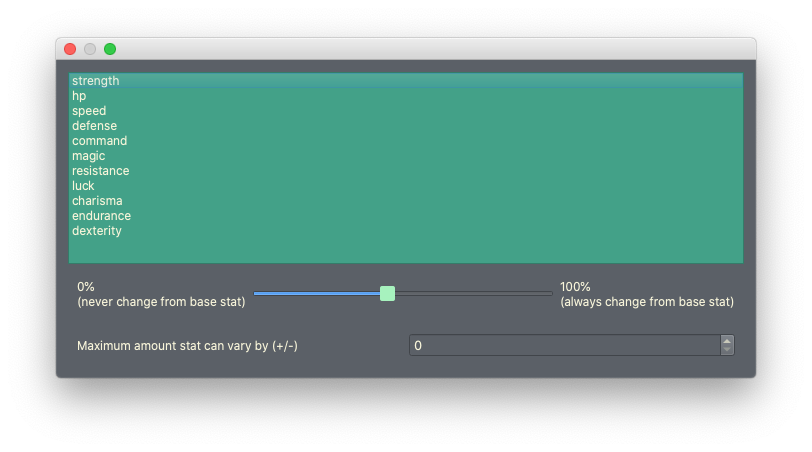
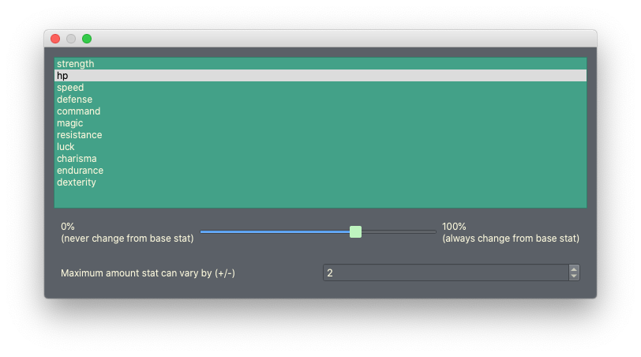
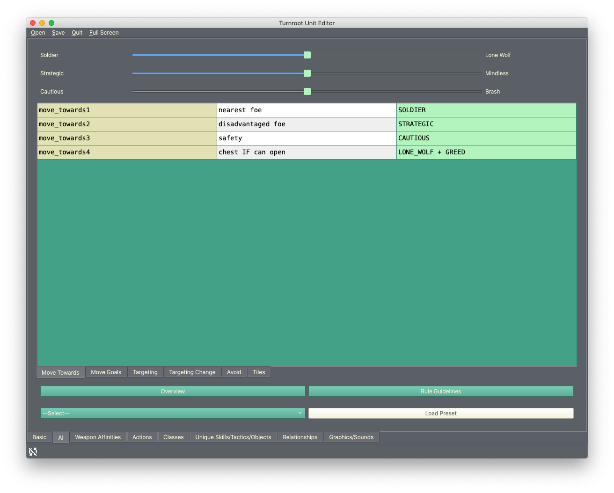
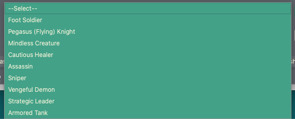
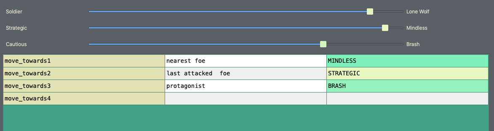
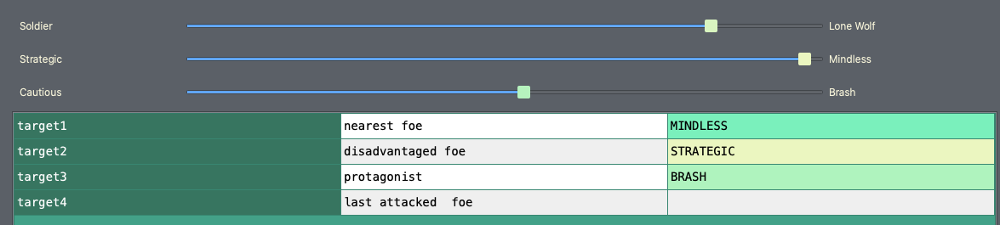

Using the Unit/Class Editor, Part 3
=====================================

.. contents::

Creating a new unit
------------------------
We're going to go ahead and create a generic enemy unit now. I'd like to mention now this is not a normal workflow- the unit editor is designed to work on one unit at a time, to completion, and this is the way you should do it in future. 

To create a new unit, you'll need to close the Turnroot builder and re-open it. You can open a saved unit at any point, but you can't create a new unit if you're already editing one. This is a safeguard to prevent accidental overrides. (You can probably see now why it's recommended to work on one unit at a time.)

Go ahead and close /re-open the builder. This time, you'll open up to the Unit Editor instead of the Game Editor. In future, you'll always open to the Unit Editor unless you change your default editor or start work on a new game. 

At this point, you're fully equipped to create the skeleton of a new unit- go ahead and do that, following the steps from the previous tutorial, and save it as "Test Enemy". This time, you can do whatever you want with the basic settings and weapon affinities, this tutorial is only going to talk about AI and Generic. Don't forget to set the unit to be an **Enemy** in the drop-down and turn on the **Generic** checkbox, like this:

   
I've made my enemy unit a "monster", just for giggles. 

Changing the Generic stat variation
------------------------------------
From the Unit Editor, you can change the stat variation of generic units and the appearance variation. You can change the weapon and class variations from the Level Editor- don't worry about this for now. (You can find more information about that in :doc:`generic`.) We're going to focus on the stats, since we haven't looked at graphics yet.

Copies of a generic unit that differ in some way are referred to as **instances**. Stat variations means instances can have a stat higher or lower than the base stat by a set amount. Obviously, in order for instances to have stat variations, the generic unit needs to have base stats. Go ahead and give your unit some base stats. For my monster, I'm giving him a lot of strength and that's about it:

   
Now go ahead and click on the **Generic** button (to the left of the checkbox.) This will pull up the stat variation dialog, which looks like this: 

This is super simple to use. For each stat in the list, you can change how likely an instance is to have a variation and how much that variation is. The **slider** changes the variation rate, and the **number** changes the variation amount. The default variation rate is 50%, for all stats. 

Which stats should we vary, for our monster? HP could be an interesting choice- let's do that! Something like this should do it:

   
I'm also going to add variance of 1 to strength and speed, turn the variance rate up for those stats, and set the rest of the variance rates to 0. (You can set a variance rate to 0 by moving the slider all the way to the left.) Our base monster has 7 strength, 13 HP, and 3 speed. Our instances, then, will have 7+/-1 strength, 13+/-2 HP, and 3+/-1 speed. One instance could have 6 strength, 15 HP, and 4 speed. Another could have 7 strength, 12 HP, and 2 speed. Pretty cool!

AI: Giving our monster a brain
------------------------------------
Go ahead and switch over to the AI tab. You should see this: 

   
Before diving in and making changes, let's break down how this editor works. There's three sections: sliders on top, a table with tabs in the middle, and buttons below. There's two ways to use the AI editor- the standard way and the advanced way. The  difference is that the standard method lets you modify existing AIs to your own needs, and the advanced lets you make your own. For the scope of this tutorial, we're going to focus solely on the standard way. The standard way is more than sufficient 90% of the time; you never even have to use the advanced method if you don't want to. (To read about the advanced method, see :doc:`making_your_own_ai`). 

The AI editor is easier to experience than to explain, so let's load an AI and start modifying it to our liking. Don't worry, this is simpler than it sounds. Go to the bottom section and open up the drop-down menu: 

These are AI **presets**: fully functional rulesets that you can modify without having to worry about making your own rules. Since we're working with a monster, the "Mindless Creature" preset seems to fit nicely. Go ahead and click that option, and then click Load Preset. You'll notice a bunch of things change in the top and middle sections: 

   
From this, we can draw some conclusions. First, a preset contains **rules** and **slider values**. Second, slider values influence rules. For example, you can see the second slider has Mindless on the right side. You can also see MINDLESS attached to the first "move_towards" rule. Third: you can see now that the color of a slider is also the color of the right column. If you move the slider between Strategic and Mindless, you'll see the colors of the first two "move_towards" rules change. What does all this mean? 

The anatomy of a rule is as follows, from left to right: priority, instruction, influence. **Priority** is simple: move_towards1 takes higher precedence than move_towards2. **Instruction** tells the unit what to do; move_towards1, in this case, is "nearest foe". move_towards2 is "last attacked foe". Lastly, **influence** determines how likely that is to take place. In this case, move_towards2 is not very likely. Can you see why? Because the value for the STRATEGIC/MINDLESS slider is far to the side of Mindless, and move_towards2 is influenced by Strategic. 

**You don't need to fully understand how all this works for the standard method.** All you need to do is load a preset and then adjust the sliders. The sliders allow you to take the 8 or so presets and turn them into thousands of unique AIs. I'm going to go ahead and change the sliders to make our monster more cautious and also more stupid. 

   
You'll notice the new slider values are similar, but definitely different. If you keep the sliders similar to the preset, the unit will behave similar to but slightly different from how the preset name would lead you to believe. In this case, "Mindless Creature" implies that this unit will attack whatever is nearest, even if it's a bad decision strategically. With the sliders where they are, that's true. You can also create a entirely new AI by changing the sliders drastically. The choice is yours! 

If you're wondering how you can test out your AI, you can do it in the Level Editor.

That's it! You've created a barebones enemy with stat variations and AI. 
