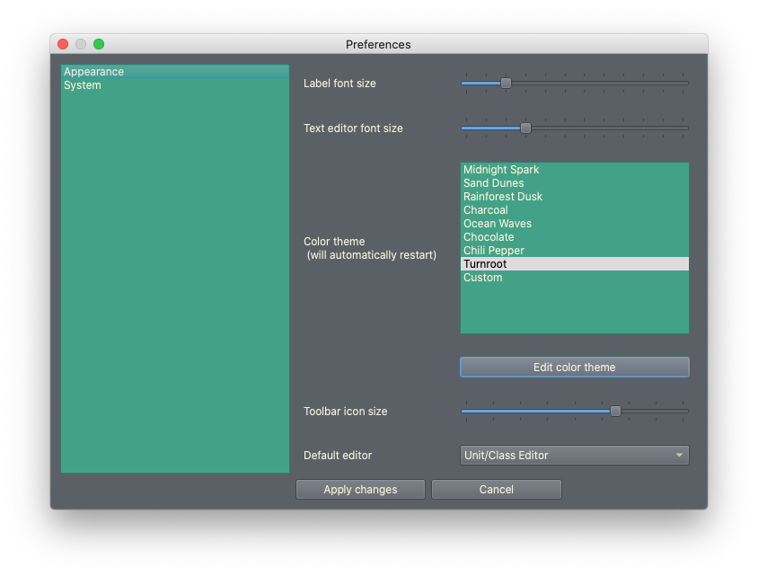
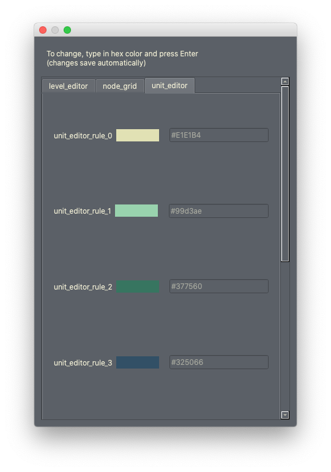

Customizing Builder Appearance
==========================================

.. contents::

.. _appearance-oveview:
General appearance settings
---------------------------
When you open the Turnroot Builder options, you'll be greeted with the appearance settings screen. 

This will look the same across most editors; some editors do have specific items, which you can learn about in :ref:`extra_appearance`.

**Label font size** is the general text size across the builder. Most of the visible text will be affected by this slider.

**Text editor font size** primarily affects the dialogue editor/other places where you can enter text. You won't often see this slider take effect, as many simple text entry fields just use label font size instead. 

Jumping past color themes, for now, **toolbar icon size** adjusts how large the icons are in the floating toolbar. 

Lastly, the **default editor** sets which editor first opens when you start the Turnroot builder. Not all editors are included- rather, the ones you'll spend most of your time in have been singled out. 

When you change an appearance setting, the builder will restart. This is normal- it needs to re-initialize all the elements. 

.. _color-theme:
Color themes
--------------------------
Color themes determine the colors of every part of the builder. You're encouraged to experiment with all of these and switch them out frequently to prevent burnout! 

The builder comes with 9 color themes: 

* Midnight Spark: a very high contrast blue theme
* Sand Dunes: a light, mid-contrast tan and brown theme with jewel-tone accents
* Rainforest Dusk: a mid-contrast green/earth tones theme
* Charcoal: a very dark, mid-contrast theme with gray as a base and orange accents (very Blender-esque) 
* Ocean Waves: a soothing blue theme with good contrast (I'm biased, as the creator, but this is my personal favorite)
* Chocolate: a rich dark brown theme
* Chili Pepper: a high contrast red and white theme
* Turnroot: the default greens and grays
* Custom: whatever you want it to be!

.. _edit-color-theme:
Edit color themes
##################
You can change any color in any color theme if you'd like. Just click **Edit color theme**. Doing so will give you this dialog: 

To change a color, type in a new hex value and press Enter. You'll see the color preview box change for that row. Once you're done with your changes, you can close the dialog. 

.. _own-color-theme:
Make your own color theme
--------------------------
Making your own color theme is done in the same way as editing a theme- in fact, you could completely re-do all the color themes and make eight of your own. The **Custom** theme, however, is specifically provided for you to make your own. 

When working on the Custom theme, try to think about contrast and how the text will appear against backgrounds. Specifically, you need ``list-background-color`` and ``window-background-color`` to have good contrast with ``window-text-color``. 80% of the UI elements use one of those two backgrounds and that text color. 

``button-alt-color`` and ``button-alt-text-color`` should have good contrast.

The "unit rules" should also be visually distinct from each other. 

.. _extra-appearance:
Editor-specific appearance settings
------------------------------------
If you're in the Skill Editor, you'll have some additional options:

* **Wire style** allows you to have either straight or curved wires between nodes. Curved in this case would be "Bezier", since they use Bezier curves.

* **Wire width** determines the thickness of wires. 
