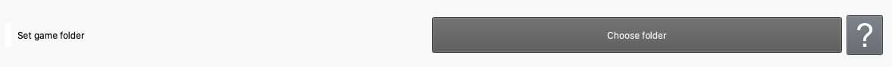
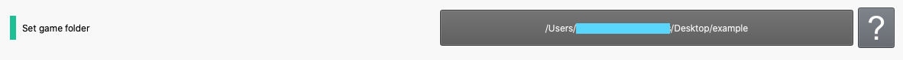
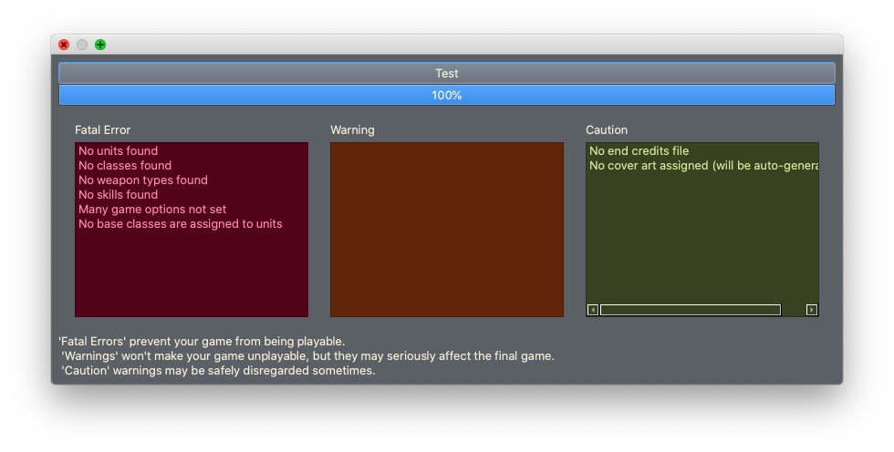

Using the Game Editor
=======================

.. contents::

.. _game-editor-what:
What is the game editor?
--------------------------
   The game editor is how you specify how your game works, and the attributes and options you want it to have.
So far, this is all you know about the game editor (from the previous document.) Let's expand on that!

In the context of the Turnroot builder, an **editor** is one of the basic interfaces or workspaces bundled into the builder. The **game editor** is the workspace where you can set the fundamental details of your game. This workspace is further divided into pages, each of which contains options. These pages are navigable by the tab bar at the top. 

Why can't I change tabs?
------------------------------------

If you've tried to change tabs and failed, here's why: there are two essential options that *must* be set before you can do anything else in the Turnroot Builder. Specifically, these are:

* The game folder
* The game name

If you create a new game, or delete the game folder you've been working on, you'll be locked down to these two options again. 

The game **folder** lets you choose a location on your computer where all the game files you'll be working on will be stored. This should be a new or empty folder; once you set this location, the builder will automatically fill the folder with the needed structure. 

The game **name** lets you set the name of the game. Bonus points if that makes you think of ABBA. 

Game options
-------------

Essential game options
#######################
Now that you know *what* you need to set, *how* do you set it?
^^^^^^^^^^^^^^^^^^^^^^^^^^^^^^^^^^^^^^^^^^^^^^^^^^^^^^^^^^^^^^^^^^

The basic structure of the game editor is very simple- for each question, you can choose an option. If you're unsure of what the question means, you can click the help button next to the choices (with the ?) to learn more. Once you choose an option, it will remain pressed unless you select a different option. For example, the game folder option looks like this:

Go ahead and choose a game folder, by clicking "Choose folder". Once you do this, you'll notice some changes:

The text of the button has changed to reflect your game folder. Also, a green indicator "light" has appeared on the left next to the question. This is a pattern you'll see all across the game editor- when you make a choice, a green light will appear so you know you've set it.

Note that you can change settings at any time, the green light doesn't mean you can't make changes. It just means that you have a choice saved to the game options.

Go ahead and set the game name as well- click "Edit" on "What is your game called?".

Other essential settings on this page
^^^^^^^^^^^^^^^^^^^^^^^^^^^^^^^^^^^^^^^^^^^^^^^^^^^^^^^^^^^^^^^^^^
Now that you've set these two options, a whole new world has opened up! You can change editors, change tabs, and use the builder freely. Take a moment to rejoice, if you want, and then take a look at the other options on this page. The **end credits** and the **cover art** are fairly self-explanatory, and you can click the "?" buttons to learn more. 

Below them, you have two buttons:

* Check game for errors
* Create game package

**Create game package**  will take all your files and turn them into a playable game. Since you don't have any files yet, this would be entirely pointless right now. Make a mental note of it for later, and let's look at **Check game for errors**. 

When you click this, it will give you a dialog with three columns of error types, and a "Test" button. To see what errors are currently in your game, click "Test". You should see something almost identical to this:

You can learn more about each specific error in :doc:`game_errors`- you don't have to worry about a deep-dive right now. No stress, you're still in the quick-start part of the documentation! For now, you should just know that errors may prevent your game from working correctly or being playable. Since you don't currently have a game ready to package, you can once again tuck this away for later and move on. 
