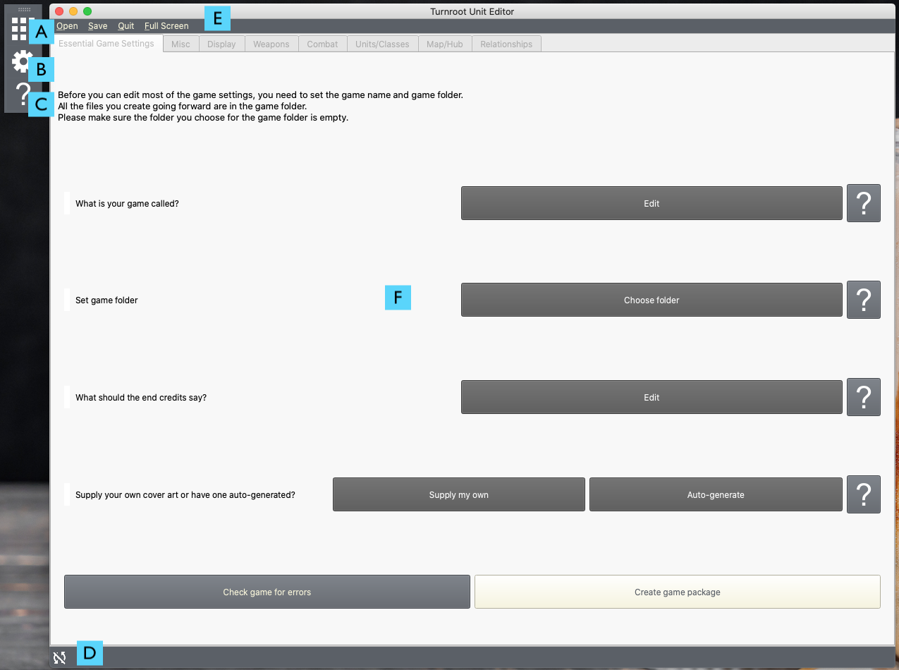
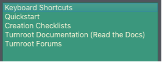

Getting Started with the Turnroot Builder
==========================================
.. contents::

.. _sysreqs:
System requirements
--------------------------
The Turnroot Editor is not super resource intensive. You should be able to run it on any computer. With that said, you should have a monitor with a display resolution of at least 1920x1080. While not required, you'll have to resize the windows to fit on a smaller monitor, and you may have to scroll to see everything. You'll also find having at least 4 GB of RAM will reduce load times slightly. 

On older or less powerful computers, you may notice a short delay from when you open the Turnroot Builder to when it actually opens. This is normal- no cause for worry! 

.. _installation:
Installation / basic setup
--------------------------

.. _first:
The first look: Turnroot Editor at a glance
--------------------------------------------
The first time you open the Turnroot Builder, this is what you'll see (minus, of course, the A-F labels):

This view is the **Game Editor**. This editor is where you set essential attributes of your game. We'll dive into the Game Editor in the next document, but for now, let's focus on what's happening here. 

A: Editor Selection
^^^^^^^^^^^^^^^^^^^^
Click this button to change which editor you're currently using. You can also press **Esc** to open editor selection. Right now, if you try to click on this, it won't let you. You can't change editors until your game has a name and a folder; we'll get to that in a second.

B: Options
^^^^^^^^^^^^^
Click this to open options. These are editor specific; different editors have different options. There are a few constants, though. You can always change the color theme, font size, icon size, and other appearance-related settings. You can also find error logs (for bug reporting.) Check out 
:doc:`customizing`
to learn more about the options dialog.

C: Help
^^^^^^^^
Click this to open Help resources. These range from creation checklists to keyboard shortcuts:

One of the most important resources is the **Forums**, where you can ask questions/share your work with other Turnroot users. 

D: Save status
^^^^^^^^^^^^^^^
This will change based on the save status and the editor. When there's a line through it, your work needs saved. When there's a check in the middle, your work is saved. 

Most things in the Turnroot Builder autosave. For example, as soon as do anything in the Game Editor, you'll notice the icon change. If you're working on something and you notice this icon is currently showing "Not Saved", you need to save your work to avoid losing changes. You'll learn more about this in documentation for the various editors.

E: Menu bar
^^^^^^^^^^^^
The options in the menu bar will change based on the editor. You'll always have Quit and Full Screen, which close the builder and make it fill your monitor, respectively. 

F: Game editor
^^^^^^^^^^^^^^^
The game editor is how you specify how your game works, and the attributes and options you want it to have. You'll notice there's a tab bar allowing you to scroll through groups of options; most editors in the builder have a tab bar, so if you're ever looking for something not on the screen, try switching tabs.

The game editor shows up whenever you don't have a game you're currently working on- if you have already started work on a game, you'll see a different editor open up when you next start the builder. Like all editors, you can access the game editor from the editor selection menu (A) to change game settings at any point. You'll learn more about the game editor and how it works in the next document, :doc:`game_editor`. 

.. _start:
The first steps to your own game
---------------------------------------------

Up next: the Game Editor!

:doc:`game_editor`
