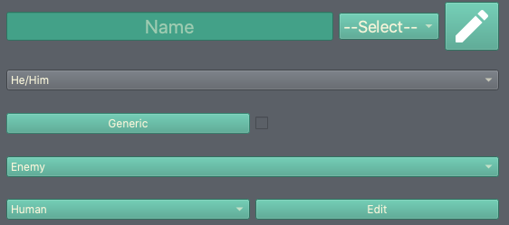
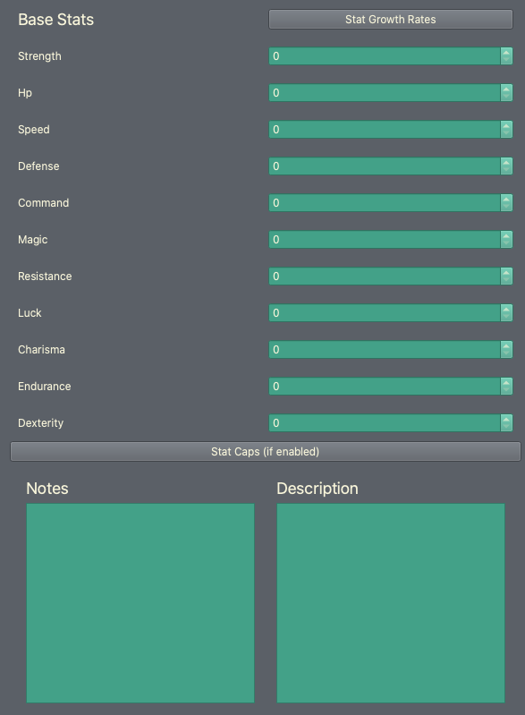

Using the Unit/Class Editor
============================
Now that you've set some basic game options, you can start learning about the other editors. We're starting with the unit/class editor because it's the default editor you'll see whenever you open Turnroot in the future.

The unit/class editor is unique, in that it is used to create and edit two separate types of things.  However, units and classes are so closely connected that it made more sense to combine them this way. (Many rounds of testing always led us back here.) 

Now, for some quick definitions: a **unit** is a character; a protagonist, an enemy, a team member, etc. A **class** defines how a unit behaves in combat, what weapons they can use, etc. These terms are used the same way they might be in a *Fire Emblem* game. 

.. contents::

.. unit-class-overview:
Editor overview- what am I looking at?
----------------------------------------

Basics
###########

.. image:: 003_ub.png
   :alt: Screenshot of Turnroot unit/class editor, basics tab
   :align: center

This is the front page of the editor, where the most basic attributes of a unit are set. 

AI
########

.. image:: 003_uai.png
   :alt: Screenshot of Turnroot unit/class editor, AI tab
   :align: center

This tab sets how the unit will behave when controlled by a computer. Currently, this means enemy units and ally units- there's no autoplay for team units. 

Weapon Affinities
##################

.. image:: 003_wa.png
   :alt: Screenshot of Turnroot unit/class editor, weapon affinities tab
   :align: center

Here you can set two things: what weapon experience levels this unit starts with, and how quickly/efficiently this unit will gain weapon experience. This second use is why the tab is called "affinities"- if the unit grows more quickly in a certain weapon, they have an affinity for it. 

Actions
#########

Classes
#######

.. image:: 003_c.png
   :alt: Screenshot of Turnroot unit/class editor, class tab
   :align: center

Rather than editing units, this tab is for editing classes. You can have two separate files open this way: a unit, and a class, and edit both. Switching between tabs will change what saving does. Saving in this tab will save the class. Saving in other tabs will save the unit. 

If this seems confusing, don't worry- both units and classes autosave, so you shouldn't have to worry about it. 

Unique
#######

Relationships
##############

.. image:: 003_r.png
   :alt: Screenshot of Turnroot unit/class editor, relationships tab
   :align: center

This tab allows you to set how this unit will interact with other units. This is primarily for team units: the ability to build support and have children is irrelevant to enemies.

There are some exceptions to this guideline. Allies may benefit from these options if they are recruitable, and any unit can have a "personal enemy". 

Graphics/Sounds
###############

Creating a unit
------------------------
If you're ready to dive in, go ahead and keep reading! If you'd like to learn more about the overall interface first, go ahead and jump to the next document: :doc:`level_editor`.

Let's go ahead and make a simple unit just to see how all this works. We're going to make a team member, so you can get your feet wet with the Relationships tab. Normally at this point, you would do some planning/brainstorming. We're going to do that for you so you can learn the interface; after that, you can start making the units of your dreams. 

Basics and bare minimums
#########################

The most important thing a unit can have is a **name**. That's not just a gesture of kindness towards your new, fictional, friend: once you give your unit a name and press Enter, you'll be able to choose the filename. Once you set the filename, all the changes you make will auto-save. Thus, you should always start a unit by giving them a name. 

You can change the name at any point, and the filename doesn't need to be related to the unit name at all. You just need a unit name to *trigger* the filename selection, and by extension, saving your unit. 

So, without further ado, go ahead and give your unit a name by typing in a name you want here:

Once you press enter, you'll be prompted to enter a filename- go ahead and do that, something like "Test Unit", and click Ok. You are now auto-saving.

Congratulations, you've just created a unit! If you open your game folder, you'll find two new files in your ``game_folder/units`` subfolder: ``Test Unit.truf``, and ``Test Unit.truf.trui``. 

There are two other fields in that screenshotted section; a **drop-down menu** and an **Edit button**. The Edit button allows you to set what classes this unit could have and the drop-down menu allows you to set the class the unit does have. This is less complicated than it sounds. Every unit can have at least one base class, and they can switch between them when reclassing. The drop-down menu lets you say which of these possible classes is the default, or the one they'll have in the game until changed. 

Currently, you don't have any classes, which means you can't do anything with either of those options. We'll get there!

There are a couple of other things you can do here. Note that you don't have to do anything in any order, once you have your unit named and saved, but you're already on this tab so you might as well. In case you're lost, here's a screenshot showing everything we'll be talking about:
 

First, you need to set this unit's **pronouns**. This will affect how they are referred to in dialogue. You can do this in the drop-down menu directly below the name row. 

Below this, you can set whether this unit is **generic** or not. A generic unit is a template for many clones or instances. These instances can have variations in appearance and stats. For example, an "enemy archer" could be just one unit- named "Enemy Archer", and you could give them variations to make the appearance of different units. To make a unit generic, click the **checkbox** next to "Generic". You can then set the variation options with the "Generic" button. 

Team members are not generic, obviously, so you can move past this for now. 

The next row lets you set the **classification** of this unit. This is mainly useful for weapon effectiveness; for example, if the unit is a dragon, they'll be weak against dragon-effective weapons. Click "Edit" to change the universal classifications. You can use this to change the theme of your game; changing fantasy to sci-fi, for example. You can leave your test unit as a Human. 

Base statistics: what do they mean, and how do I use them? 
############################################################

On the right side of the editor, you can edit the **base statistics** and **statistic growth** rate of your unit. Base statistics determine who the unit is, and growth determines who the unit will become. You can hover over any of the statistics to learn what they influence. 

This list may not match yours, by the way; you can disable Command and Endurance entirely in the game options. (Read about why you would do that in :doc:`game_options`)

Regardless, there's only one stat that must be higher than 0 for the unit to work correctly: HP (health points).  **A unit with no health is dead.** Sounds obvious, I know, but a unit with max HP can't go 

**Stat caps** lets you set the maximum amount this unit can have of each stat. If you hadn't guessed from the (if enabled), this can be turned on or off in the game options. 

**Notes** lets you leave yourself notes about this unit- for example, "this unit doesn't have a class assigned yet". That was partially an example and partially a suggestion; your friendly neighborhood Test Unit does not, in fact, have a class assigned, so this would be a good note to leave. 

**Description** is the flavor text that will show in-game for this unit. 
