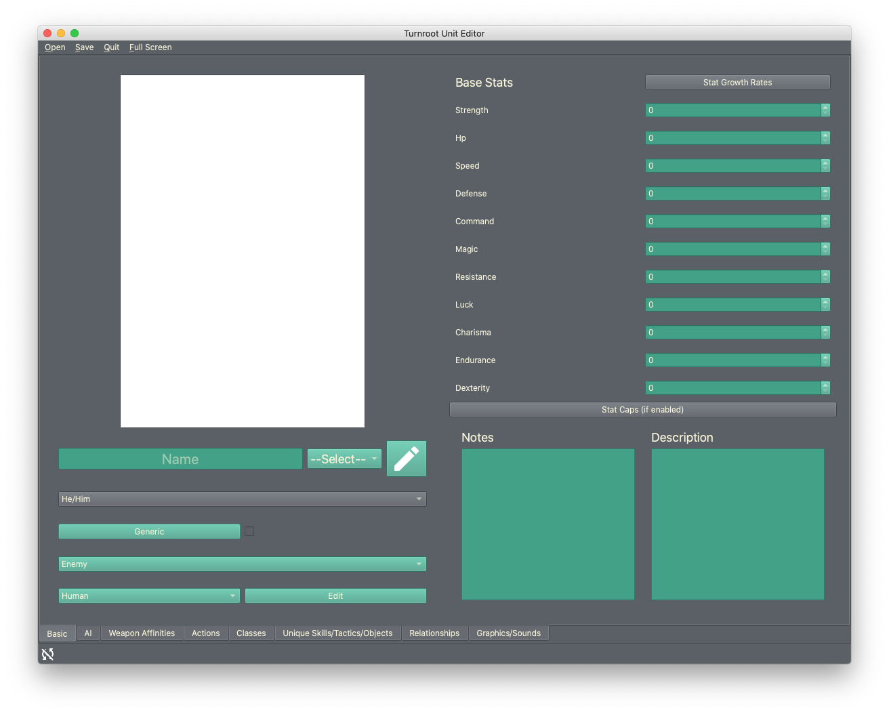
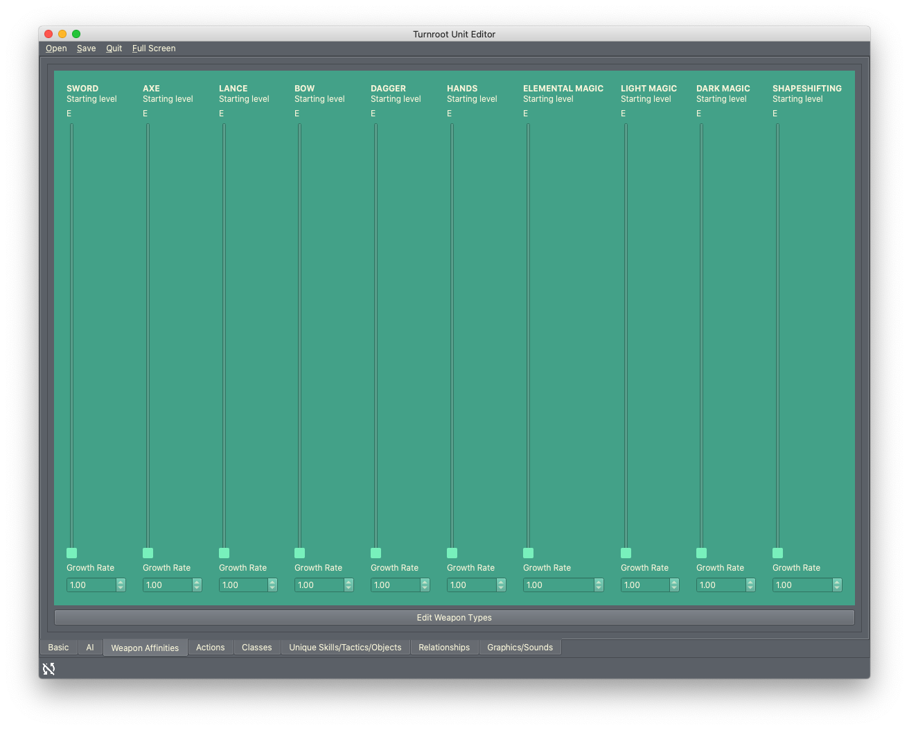
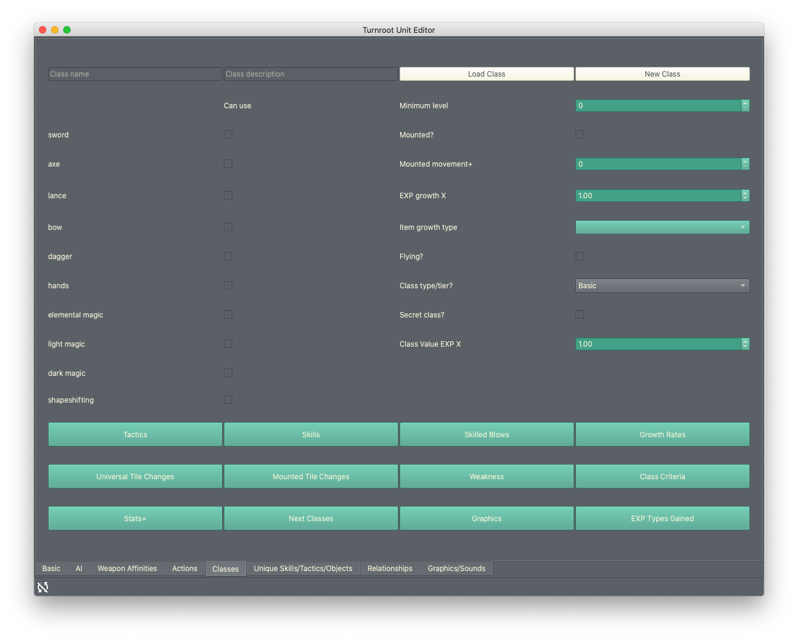
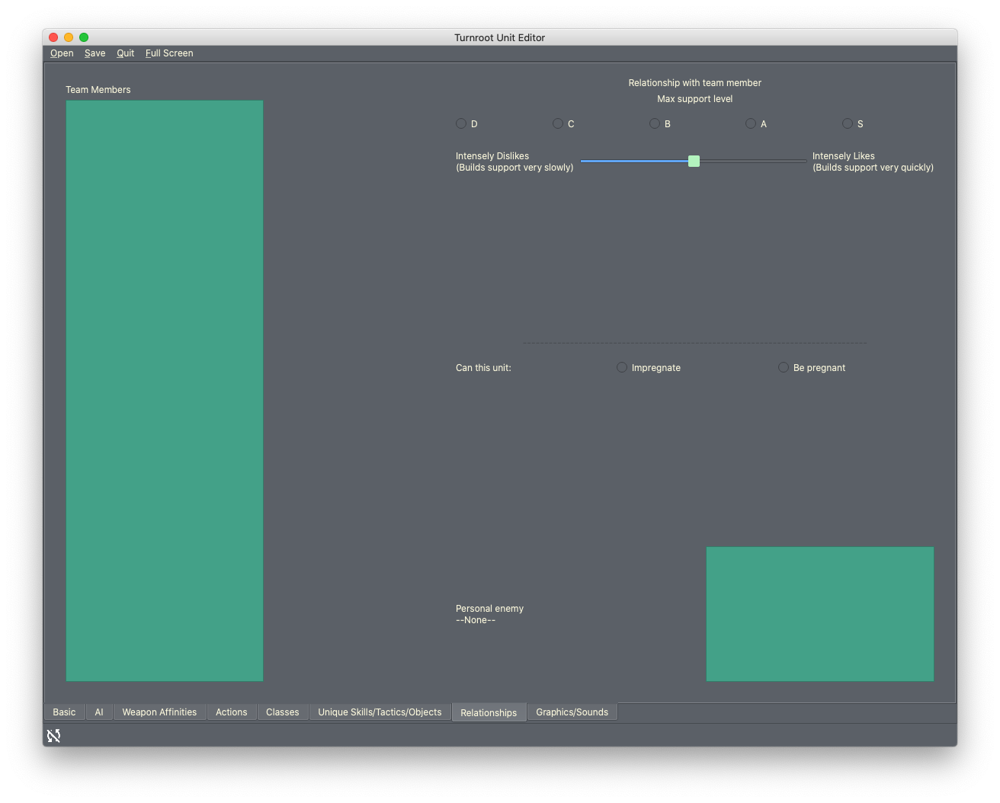

Using the Unit/Class Editor
============================
Now that you've set some basic game options, you can start learning about the other editors. We're starting with the unit/class editor because it's the default editor you'll see whenever you open Turnroot in the future.

The unit/class editor is unique, in that it is used to create and edit two separate types of things.  However, units and classes are so closely connected that it made more sense to combine them this way. (Many rounds of testing always led us back here.) 

Now, for some quick definitions: a **unit** is a character; a protagonist, an enemy, a team member, etc. A **class** defines how a unit behaves in combat, what weapons they can use, etc. These terms are used exactly the same way they might be in a *Fire Emblem* game. 

.. contents::

.. unit-class-overview:
Editor overview- what am I looking at?
----------------------------------------

Basics
###########

This is the front page of the editor, where the most basic attributes of a unit are set. 

AI
########

.. image:: 003_ai.png
   :alt: Screenshot of Turnroot unit/class editor, AI tab
   :align: center

This tab sets how the unit will behave when controlled by a computer. Currently, this means enemy units and ally units- there's no autoplay for team units. 

Weapon Affinities
##################

Here you can set two things: what weapon experience levels this unit starts with, and how quickly/efficiently this unit will gain weapon experience. This second use is why the tab is called "affinities"- if the unit grows more quickly in a certain weapon, they have an affinity for it. 

Actions
#########

Classes
#######

Rather than editing units, this tab is for editing classes. You can have two separate files open this way: a unit, and a class, and edit both. Switching between tabs will change what saving does. Saving in this tab will save the class. Saving in other tabs will save the unit. 

If this seems confusing, don't worry- both units and classes autosave, so you shouldn't have to worry about it. 

Unique
#######

Relationships
##############

This tab allows you to set how this unit will interact with other units. This is primarily for team units: the ability to build support and have children is irrelevant to enemies.

There are some exceptions to this guideline. Allies may benefit from these options if they are recruitable, and any unit can have a "personal enemy". 

Graphics/Sounds
###############

Making your first unit
------------------------
Because of the sheer amount of information a unit contains, this document may be a little long. Please note that everything in this editor has a "learn more" feature on hover that can answer many of your questions. You can also learn a lot about how this works both from your experience with this genre of game, and also from just messing around. Lastly, don't let the length of this document scare you- this editor, like all of Turnroot, has been meticulously tested to make it as simple to use as possible.

If you're ready to dive in, go ahead and keep reading! If you'd like to learn more about the overall interface first, go ahead and jump to the next document: :doc:`level_editor`.

Basics and bare minimums
#########################

Making your first class
------------------------

