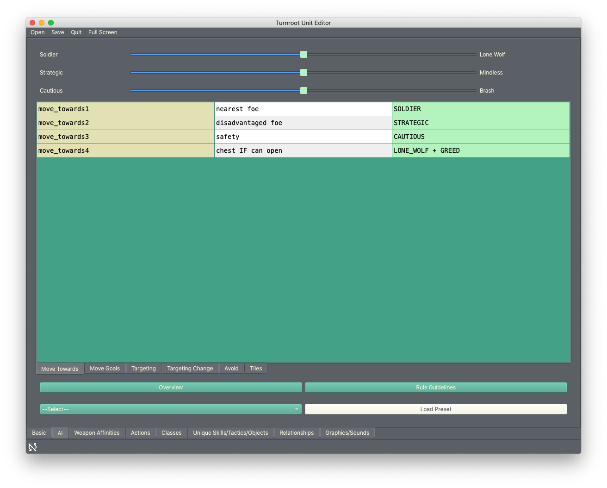

Using the Unit/Class Editor
============================
Now that you've set some basic game options, you can start learning about the other editors. We're starting with the unit/class editor because it's the default editor you'll see whenever you open Turnroot in the future.

The unit/class editor is unique, in that it is used to create and edit two separate types of things.  However, units and classes are so closely connected that it made more sense to combine them this way. (Many rounds of testing always led us back here, to our surprise.) 

Now, for some quick definitions: a **unit** is a character; a protagonist, an enemy, a team member, etc. A **class** defines how a unit behaves in combat, what weapons they can use, etc. These terms are used exactly the same way they might be in a *Fire Emblem* game. 

.. contents::

.. unit-class-overview:
Editor overview- what am I looking at?
----------------------------------------

Basics
###########

.. image:: 003_ub.png
   :alt: Screenshot of Turnroot unit/class editor, basics tab
   :align: center

This is the front page of the editor, where the most basic attributes of a unit are set. 

AI
########

Weapon Affinities
##################

.. image:: 003_wa.png
   :alt: Screenshot of Turnroot unit/class editor, weapon affinities tab
   :align: center

Actions
#########

Classes
#######

.. image:: 003_c.png
   :alt: Screenshot of Turnroot unit/class editor, class tab
   :align: center

Unique
#######

Relationships
##############

.. image:: 003_r.png
   :alt: Screenshot of Turnroot unit/class editor, relationships tab
   :align: center

Graphics/Sounds
###############

Making your first unit
------------------------

Making your first class
------------------------

