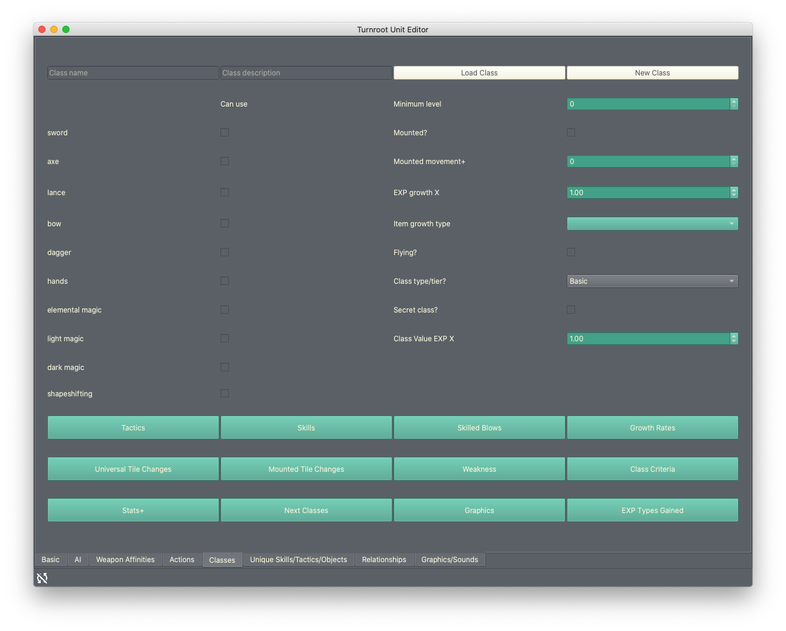
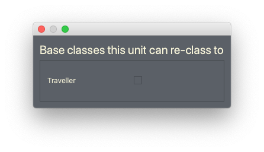

Using the Unit/Class Editor, Part 2
======================================
.. contents::

Making your first class
------------------------

Basics
###########

It's time to take Test Unit to the next level- let's make a class for them! We're going to be making a **Basic** tier class. You can change how many tiers of classes there are in the game options (:doc:`game_options`), like this: 

Specifically, we're going to make the default class; or in other words, the base class this unit will have before any reclassing or growth has happened. 

The top row: saving and loading
^^^^^^^^^^^^^^^^^^^^^^^^^^^^^^^^^
The class editor breaks nicely into sections. The top row is for saving and opening classes, the middle section is for setting quick options, and the bottom part is for setting more complex details. Let's start with the top. 

Much like the unit editor, you need to name your class to save it. This time, however, the class file will be saved as the class name. When you enter a **class name** and press Enter, your class will be saved as ``classes/class name.tructf`` in your game folder. Units are much more likely to share a name, hence the extra step of specifying a filename.

If you can't enter a name, click **New Class**. Now it will work. (Sometimes Turnroot will "load" a class that has empty data, preventing you from making a new class.) 

Once you have a class named, you can click **Load Class** and select it from the list to edit it. 

Let's go ahead and give this class a name so it can start auto-saving. We're going to call it "Traveller". It will be a very simple class. Type "Traveller" in "Class name" and press Enter. Your class is now saved.

You can also provide a **class description**, which is in-game flavor text. Let's do that: go ahead and put something like "A basic voyager with no remarkable abilities. Uses swords, hands, and lances." 

Having said that, we need to make this class actually use those weapon types! One of the most important features of a class is determining what weapon types the unit can use with this class. No class, no weapons. We can move on to the middle section for that.

The middle section: weapon types and basic settings
^^^^^^^^^^^^^^^^^^^^^^^^^^^^^^^^^^^^^^^^^^^^^^^^^^^^^^

.. image:: 004_ms.png
   :alt: Screenshot of Turnroot game options, showing class tier selection
   :align: center

Ignore the right half of this section for a second. You can probably figure out just by looking how to set the weapon types this class can use. If not, it's super simple: just click the checkbox for each weapon type the class can use. In this case, that would be Sword, Lance, and Hands. 

If you don't like your weapon type options, take a look at :doc:`weapon_types` to change them. Remember that you need to do that sooner rather than later. 

With that done, let's head on over to the right side. 

Minimum level and class qualifications
@@@@@@@@@@@@@@@@@@@@@@@@@@@@@@@@@@@@@@@

**Minimum level** determines what level the unit must have before qualifying for this class. Now's a good time for a sidebar about class qualification. There are three options for how a unit can qualify for a class: level-based, criteria-based, or both. This is a universal setting, and you can set it in game options. (If you're not tired of seeing this link yet, it's here again! :doc:`game_options`) 

* **Level-based** means the only requirement to gain a class is unit level. This can be combined with reclassing items very well. For example, in *Fire Emblem Awakening*, you can reclass to an Advanced class at level 10 if you use a Master Seal. This is a level-based qualification.

* **Criteria-based** means the unit must meet requirements in weapon experience and/or stats. Rather than "the unit can get it or not", the unit has a % chance of getting the class based on how many of the requirements they meet. 

  Here's an example: Let's say you have a class that required an A in lance, a B in dark magic, and a B in riding. If your unit 
  had a B+ in lance, a B in dark magic, and a B in riding, they would have a 89% 
  chance of being to gain this class, regardless of level. To learn more about how this works, see 
  :doc:`class_qualifications`.

* **Both** combines the two- once the unit hits the specified level, they have a % chance of being able to gain the class. This is the system *Fire Emblem: Three Houses* uses.

Mounted, flying, mounted movement
@@@@@@@@@@@@@@@@@@@@@@@@@@@@@@@@@@@@@@@
A mounted class will put your unit on a horse, or a pegasus, or a giant eel-hound (Avatar: The Last Airbender style)... whatever the case may be, they will be mounted! This comes with a few changes: 

* The unit will have increased movement radius by default
* The  unit  will have the option to Dismount; restoring their movement radius to normal. Once dismounted, they can mount again.
* The unit will have a new momement type, which in turn will make them weak against certain weapons but may have positive effects. 
* The unit will move on tiles differently- tiles that slow mounted units will slow the unit

If you turn on the **Mounted?** checkbox, this class will be mounted. Directly underneath it, you have **Mounted movement+**; this allows to set how much their movement radius will be increased by. **It does not set the new movement radius!** To clarify: if the unit's movement is 4, and this is set to 2, they'd have a total movement radius of 6.

There's another checkbox, further down- **Flying**. Flying used in combination with Mounted means that a unit will not be affected by any tile effects and can move on any tile except tall walls/cliffs/etc. Flying units don't have any tiles that slow them down, because they're in the air. Flying classes are, however, weak to arrows.

You can turn on Flying by itself, but it won't affect anything unless Mounted is also turned on.

Our Traveller class will not be mounted. You can leave all of this as is.

Tiers
@@@@@@

The **Class type/tier?** drop-down lets you set what level this class is. Only **Basic** classes will show up in the class selection dialog for a unit; you can change a unit to a higher tier class in gameplay. For our Traveller class, we'll leave it as a Basic tier. 

**Secret class?** is a class that doesn't show up normally when reclassing. This class won't show up in that list- whether it's the full tier or the select list- EXCEPT for the specific unit that can use it. For example: the "Great Lord" class in *Fire Emblem: Awakening* is only available to a couple units. A similar case is "Enlightened One" in *Fire Emblem: Three Houses*. Essentially, a secret class is a unit-specific or event-given class. This description doesn't apply to our "Traveller", so you can leave it unchecked. 

For more information about class tiers/secret classes, see :doc:`reclassing`. 

EXP X
@@@@@@@@

**EXP Growth X** determines how quickly this unit levels up. You can use this to set it so units level up more quickly at base tiers, and level up more slowly (comparatively) at advanced tiers. This may seem weird, so think about it this way: a unit will probably get more kills per battle at a higher tier. If EXP growth stays constant, they'll actually level up much FASTER as a higher tier class because of this. Thus, by slowing down their experience at higher levels, you're actually balancing out their rate of growth between tiers. 

You can also just leave all your classes at 1 if you don't want to do this. 

For our Traveller, you can set it to something like 1.2, if you are balancing your tiers, or leave it at 1 otherwise. 

**Class Value EXP X** determines how much EXP this class gives when *killed*. From the perspective of Test Unit, this may seem weird, but think about if you have an enemy boss that needs to give a higher reward for killing. By giving that boss a unique "Boss" class or something, and turning this up, you'll get more EXP from that kill. This is a very common mechanic in games of this sort. 

You can leave this at 1 for our Traveller class.

Both of the EXP X values go from .10 to 3.00. This is a multiplier: 1.0 means a normal level, 2.0 would be twice, and .5 would be half. 

For more information about growth, see :doc:`unit_growth`. 

The bottom row: advanced options
^^^^^^^^^^^^^^^^^^^^^^^^^^^^^^^^^

Each of these buttons adds features and functionality to a class. There's a lot here, and I don't want to overwhelm you, so we're going to skip over this for now. You can read about what these buttons do in :doc:`class_features`. 

Assigning classes to unit
############################

At this point, if you've done everything on the top section and middle section, your class is ready to go! You should come back and work on those bottom section buttons at some point, but for now, let's go ahead and assign our Test Unit this class. 

Head back over to the "Basic" tab. You should see your Test Unit, still loaded and ready to edit. Click on the pencil icon next to the unit name, and you should see this:

   
Click the checkbox next to Traveller and close the dialog. Now, when you go to the drop down list, you'll see this:

   
Go ahead and select Traveller from this list. Your Test Unit now has an assigned default class!

What have you done so far?
---------------------------

At this point, you've learned how the game options work and set some, created a unit, created a class, and assigned the class to the unit. This is incredible progress! Our next task is going to be making a generic enemy unit. This will show you how the features we've skipped over so far in the unit editor work. When you're ready, head over to :doc:`unit_class_editor_p3`. 
