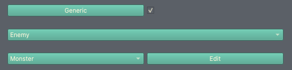

Using the Unit/Class Editor, Part 3
=====================================

.. contents::

Creating a new unit
------------------------
We're going to go ahead and create a generic enemy unit now. I'd like to mention now this is not a normal workflow- the unit editor is designed to work on one unit at a time, to completion, and this is the way you should do it in future. 

To create a new unit, you'll need to close the Turnroot builder and re-open it. You can open a saved unit at any point, but you can't create a new unit if you're already editing one. This is a safeguard to prevent accidental overrides. (You can probably see now why it's recommended to work on one unit at a time.)

Go ahead and close /re-open the builder. This time, you'll open up to the Unit Editor instead of the Game Editor. In future, you'll always open to the Unit Editor unless you change your default editor or start work on a new game. 

At this point, you're fully equipped to create the skeleton of a new unit- go ahead and do that, following the steps from the previous tutorial, and save it as "Test Enemy". This time, you can do whatever you want with the basic settings and weapon affinities, this tutorial is only going to talk about AI and Generic. Don't forget to set the unit to be an **Enemy** in the drop-down and turn on the **Generic** checkbox, like this:

   
I've made my enemy unit a "monster", just for giggles. 

Changing the Generic stat variation
------------------------------------
From the Unit Editor, you can change the stat variation of generic units and the appearance variation. You can change the weapon and class variations from the Level Editor- don't worry about this for now. (You can find more information about that in :doc:`generic`.) We're going to focus on the stats, since we haven't looked at graphics yet.

Copies of a generic unit that differ in some way are referred to as **instances**. Stat variations means instances can have a stat higher or lower than the base stat by a set amount. Obviously, in order for instances to have stat variations, the generic unit needs to have base stats. Go ahead and give your unit some base stats- for reference, here are mine:

